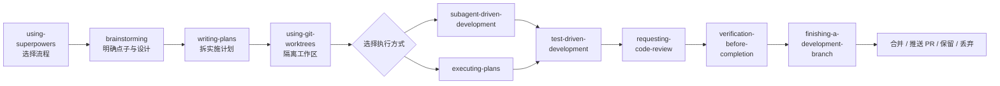

> 记录时间：2026-07-23 09:59:31

第一次看到 Superpowers 提供的 14 个 Skills，很容易把它们理解成一张从上到下逐项执行的检查表。照这种理解，每次改代码都要先头脑风暴、写设计、拆计划、创建 Worktree、派发子代理、做 TDD、请求评审，再走完分支收尾。哪怕只是修改一行文案，也像在启动一个完整的软件项目。

但这 14 个 Skills 并不是 14 个顺序执行的步骤。它们共同组成一套开发流程：其中 9 个构成从点子到 Git 集成的主线，另外 5 个在调试、并行、评审反馈或 Skill 开发时按需插入。

## 一条主线，几种条件分支

Superpowers 的主流程可以画成这样：

它表达的不是“调用完一个 Skill，再调用下一个 Skill”这么机械。更准确地说，每个 Skill 负责守住一个开发关卡：

1. `using-superpowers` 判断当前任务需要哪些方法。
2. `brainstorming` 把模糊想法变成经过确认的设计。
3. `writing-plans` 把设计拆成可以逐项执行和验证的步骤。
4. `using-git-worktrees` 为实施创建隔离环境，并确认基线正常。
5. `subagent-driven-development` 或 `executing-plans` 负责执行计划，两者选择其一。
6. `test-driven-development` 约束每项代码修改的实现节奏。
7. `requesting-code-review` 在阶段任务完成后引入独立审查。
8. `verification-before-completion` 用最新、完整的命令结果证明任务已经完成。
9. `finishing-a-development-branch` 处理合并、PR、保留或丢弃分支。

这里的“发布”主要指完成 Git 集成与 Pull Request，并不等于生产部署。Superpowers 没有专门负责上线生产环境的 Skill；真正的部署、冒烟测试、监控与回滚，仍然要使用项目自己的脚本或其他部署 Skill。

## 异常流程按需插入

主线之外的 Skills 不是遗漏的步骤，而是条件触发的处理方法。

- 出现 Bug、测试失败或异常行为时，插入 `systematic-debugging`，先查根因再修复。
- 收到人工或外部评审意见时，插入 `receiving-code-review`，先验证意见是否适用，再逐项修改。
- 同时存在两个以上真正独立的问题时，使用 `dispatching-parallel-agents` 并行调查或修复。
- 创建或修改其他 Skill 时，使用元技能 `writing-skills`。

这也解释了为什么不能把 14 个 Skills 排成一条直线：调试、并行和接收评审都依赖具体情境，不应该在每个任务中强制发生。

## 从点子到 Git 集成

完整流程从识别任务类型开始。`using-superpowers` 会先检查可用 Skills，并决定当前任务适合走哪条路径。用户的明确指令优先级更高，因此这一步不是替用户增加流程，而是选择恰当的方法。

对于新功能、UI 或行为修改，`brainstorming` 先阅读项目、逐个澄清问题、比较两到三个方案，形成经过用户确认的设计。随后，`writing-plans` 把设计拆成短小步骤，明确文件路径、接口、代码、测试命令和预期结果。

进入实施前，`using-git-worktrees` 检查当前工作是否已经隔离。必要时创建 Worktree、安装依赖并运行基线测试，避免后续修改污染正在使用的分支。

执行计划时有两条路：

- `executing-plans` 由当前代理直接逐项实施，适合计划明确且不需要子代理的任务。
- `subagent-driven-development` 为相对独立的计划项安排全新的实施代理，再进行规格与质量评审。实施代理通常依次修改代码，不等同于并行开发。

无论选择哪个执行器，代码修改都通过 `test-driven-development` 完成：先写失败测试并确认红灯，再写最小实现让测试转绿，最后在测试持续通过的前提下重构。如果中间出现失败，则切换到 `systematic-debugging`，通过稳定复现、证据收集、单一假设和最小实验定位根因。

阶段任务完成后，`requesting-code-review` 根据 base 与 head SHA 派发独立评审，优先处理 Critical 和 Important 问题。全部实现完成后，`verification-before-completion` 重新运行能够证明结论的完整命令，读取输出与退出码，避免用旧结果或主观判断宣布成功。

最后，`finishing-a-development-branch` 再次确认测试、分支和基线状态，让用户从合并、推送 PR、保留分支或丢弃工作中作出选择，并按选择清理 Worktree 与分支。

## 14 个 Skills 各自负责什么

| Skill | 何时使用 | 核心流程与产出 |
| --- | --- | --- |
| `using-superpowers` | 每次对话开始 | 检查可用 Skills，再决定调用顺序；用户明确指令可以覆盖默认流程。 |
| `brainstorming` | 新功能、UI、行为修改等创意工作 | 检查项目，逐个提问，提供 2–3 个方案，确认设计并写入 `docs/superpowers/specs/`，再转交计划阶段。 |
| `writing-plans` | 已有确认过的设计 | 将需求拆成 2–5 分钟的小步骤，写清文件、接口、代码、测试命令与预期结果，保存到 `docs/superpowers/plans/`。 |
| `using-git-worktrees` | 开始实施计划前 | 检查是否已经隔离，必要时创建 Worktree、安装依赖并运行基线测试。 |
| `executing-plans` | 在当前代理中执行现成计划 | 审阅计划，建立任务列表，逐项执行与验证，最后进入分支收尾。 |
| `subagent-driven-development` | 有多项相对独立的计划任务 | 每项任务使用新的实施代理，经过规格评审、质量评审、修复和复审，最后进行整分支评审。 |
| `dispatching-parallel-agents` | 有两个以上真正独立的问题 | 按问题域拆分任务，并行调查或修复，检查冲突后运行完整测试。 |
| `test-driven-development` | 实现功能或修复 Bug | RED：先写失败测试；GREEN：写最小实现；REFACTOR：在测试通过时整理代码。 |
| `systematic-debugging` | Bug、测试失败或异常行为 | 收集证据与稳定复现，对照正常实现，提出单一假设并做最小实验，最后补回归测试并修复。连续三次失败后重新检查架构假设。 |
| `requesting-code-review` | 阶段任务完成、重大功能完成或合并前 | 确定 base/head SHA，派发独立评审，立即处理 Critical 和 Important，酌情安排 Minor。 |
| `receiving-code-review` | 收到人工或外部评审意见 | 完整阅读，在代码中验证意见是否适用，给出技术回应，再逐项修改和测试。 |
| `verification-before-completion` | 准备宣布完成、提交或创建 PR 前 | 明确能够证明结论的命令，重新运行并检查完整输出与退出码，有证据后再宣布成功。 |
| `finishing-a-development-branch` | 实现完成且测试通过 | 再次测试并确认分支与基线，提供合并、推送 PR、保留、丢弃四种选择，按选择清理环境。 |
| `writing-skills` | 创建或修改 Skill | 建立没有 Skill 时的失败基线，编写最小 Skill，多轮测试触发率与遵循率，收紧规则，验证后发布。 |

## 三类角色更容易记

如果不想记住 14 个名字，可以按角色理解：

**主线关卡**负责把一个想法推到可集成状态，包括 `using-superpowers`、`brainstorming`、`writing-plans`、Worktree 管理、执行器、TDD、评审、验证和分支收尾。

**条件工具**在特定情境下介入，包括并行代理、系统调试和接收评审。请求代码评审通常位于主线上，但对于很小的任务也可以按风险决定是否使用。

**元技能**只有 `writing-skills`，它不直接开发产品，而是用测试驱动的方法开发其他 Skills。

## 它为什么显得很重

Superpowers 主要面向中大型、需要审计或多人协作的开发任务。它把设计、计划、隔离、实现、评审、验证和 Git 集成全部设为显式关卡。这样做提高了可追踪性，也能减少代理在长任务中偏离需求、跳过测试或过早宣布完成的风险。

代价同样明显：设计文档、实施计划、Worktree、子代理评审和分支收尾都会产生固定成本。直接把完整流程套在改文案、改配置或局部样式这类小任务上，流程成本可能高于代码修改本身。

因此，正确的用法不是“每次执行全部 14 个 Skills”，而是先识别任务的规模、风险和协作方式，再选择需要经过的关卡。中大型功能可以走完整主线；已有设计的任务可以从计划或执行阶段开始；小改动则保留必要的实现与验证，省略不会降低风险的环节。

Superpowers 真正提供的不是一份冗长清单，而是一套可以按风险裁剪的开发控制系统。主线保证工作从想法走到可验证、可评审、可集成的结果，插入式技能负责处理异常和协作，元技能则让这套方法本身也能被测试和改进。
